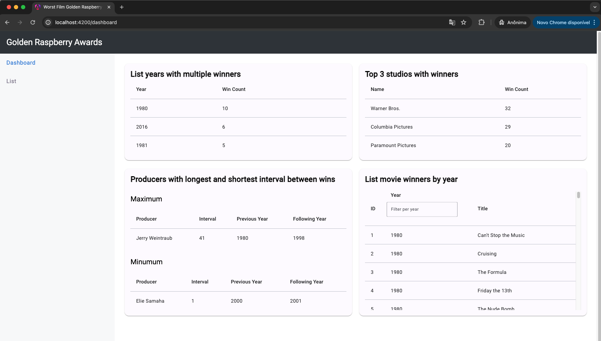
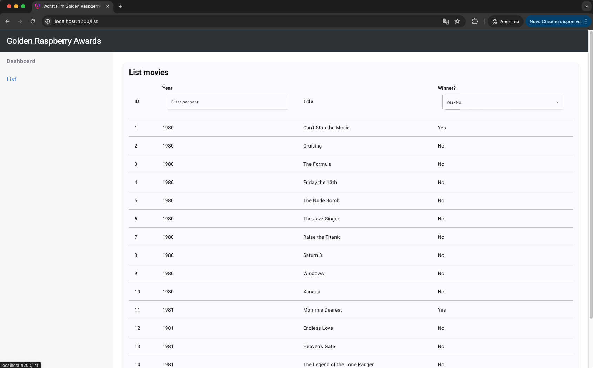
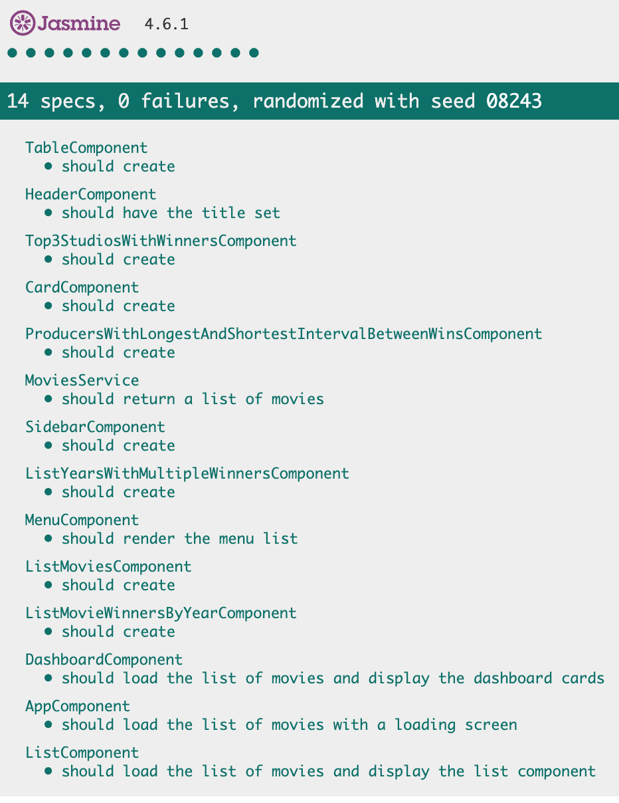

# 🌕 🍇 🏆 Golden Raspberry Awards

This project was generated with [Angular CLI](https://github.com/angular/angular-cli) version 18.0.1.

## Preview

The app is live on [`https://carlosgomes-co.github.io/worst-film-golden-raspberry-awards`](https://carlosgomes-co.github.io/worst-film-golden-raspberry-awards).

<details>
	<summary><b>Preview Dashboard</b></summary>

  

</details>

<details>
	<summary><b>Preview List</b></summary>

  

</details>

<details>
	<summary><b>Preview Test Coverage</b></summary>

  

</details>

<details>
	<summary><b>API Issue found</b></summary>

The backend queries received didn't work properly. So I am using all the data from the request: `https://tools.texoit.com/backend-java/movies?size=206`.
	
These are the routes that doesn't return the expected data:
	
```
	  https://tools.texoit.com/backend-java/movies?page=9&size=99&winner=true&year=2018
	  https://tools.texoit.com/backend-java/movies?projection=years-with-multiple-winners
	  https://tools.texoit.com/backend-java/movies?projection=studios-with-win-count
	  https://tools.texoit.com/backend-java/movies?projection=max-min-win-interval-for-producers
	  https://tools.texoit.com/backend-java/movies?winner=true&year=2018
```
	
Those routes reponse are almost equals and doesn't represent the contract mentioned in the challenge pdf.

</details>

## Development server

Run `ng serve` for a dev server. Navigate to `http://localhost:4200/`. The application will automatically reload if you change any of the source files.

## Code scaffolding

Run `ng generate component component-name` to generate a new component. You can also use `ng generate directive|pipe|service|class|guard|interface|enum|module`.

## Build

Run `ng build` to build the project. The build artifacts will be stored in the `docs/` directory.

## Running unit tests

Run `ng test` to execute the unit tests via [Karma](https://karma-runner.github.io).

## Running end-to-end tests

Run `ng e2e` to execute the end-to-end tests via a platform of your choice. To use this command, you need to first add a package that implements end-to-end testing capabilities.

## Further help

To get more help on the Angular CLI use `ng help` or go check out the [Angular CLI Overview and Command Reference](https://angular.dev/tools/cli) page.
